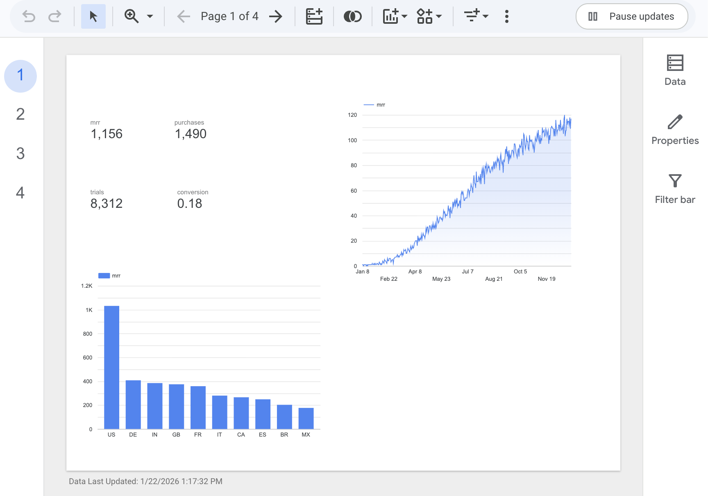
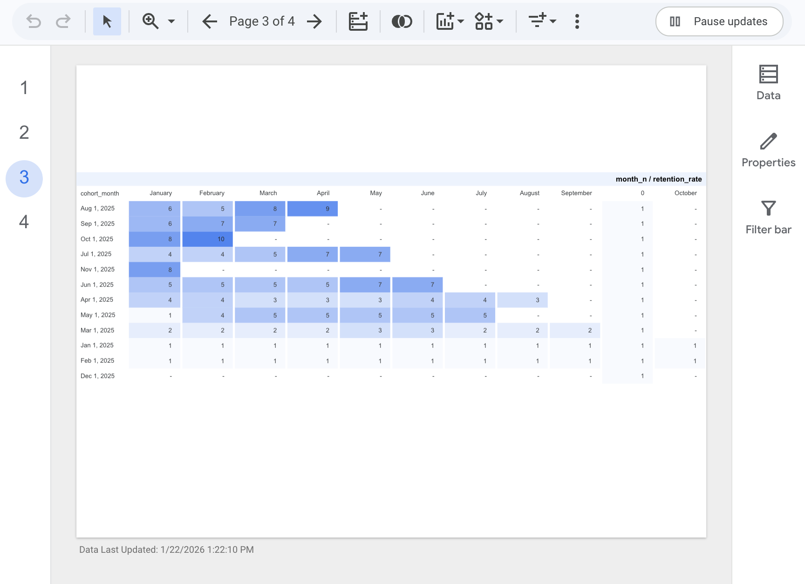
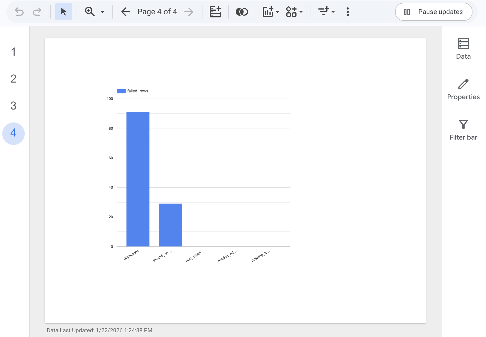

# Digital Extras Analytics Demo (Mercedes Internship)

End-to-end demo inspired by connected-car digital subscriptions (digital extras):
synthetic event data → Databricks-style pipeline (bronze/silver/gold) → KPI tables (SQL) → Power BI dashboard.

## Stack
- SQL (KPI queries: funnel, retention, MRR, usage)
- Python (data generation + data quality checks)
- Databricks notebooks (pipeline)
- Azure Storage (optional demo setup)
- Power BI (dashboard)
- GitHub (documentation + reproducibility)

## Deliverables
- Power BI dashboard screenshots
- KPI tables (gold layer)
- Data quality monitoring results
- Short insights & recommendations

## Dashboard (Looker Studio)

### Overview

### Funnel

### Cohorts

### Data Quality

